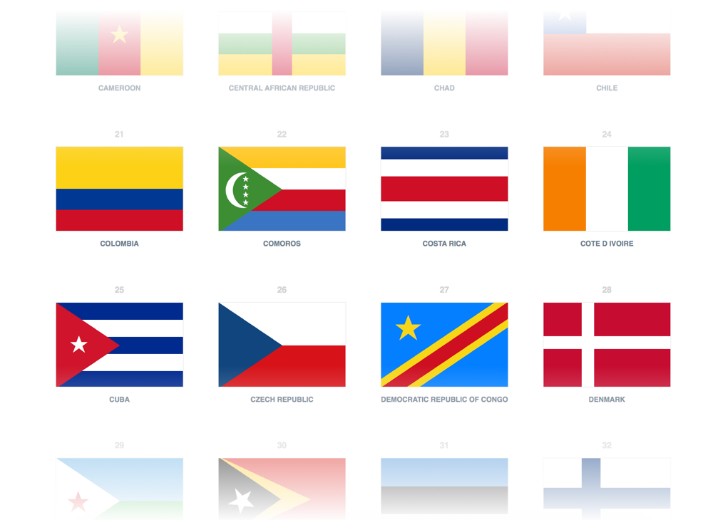

Single Div Pure CSS Flags
=========================

[](https://CSSGrid.io/friend/DHANISH) [](https://Flexbox.io/friend/DHANISH)

[Using the Library](#how-to-use-the-library)

[Instructions for Developers](#instructions-for-developers)



## How to use the library

[Grab the style.css](./css/style.css)

For the purpose of this personal project, first, I have an empty div with the class of "flag"

```HTML
<div class="flag"></div>
```
The flag class contains these fixed properties
```CSS
.flag {
  width: 180px;
  height: 120px;
  overflow: hidden;
  border: 1px solid #efefef;
}
```
There is a class for each country that you can chain after the `.flag` class

for example

```HTML
<div class="flag brazil"></div>
```

Most of the flags were not possible in a single div, so they are not included, but here are the ones that are:

| Class Names   |
| ------------- |
| .algeria |
| .armenia |
| .austria |
| .azerbaijan |
| .bahamas |
| .bahrain |
| .bangladesh |
| .barbados |
| .belgium |
| .benin |
| .bolivia |
| .botswana |
| .brazil |
| .bulgaria |
| .burkina-faso |
| .burundi |
| .cameroon |
| .central-african-republic |
| .chad |
| .chile |
| .colombia |
| .comoros |
| .costa-rica |
| .cote-d-ivoire |
| .cuba |
| .czech-republic |
| .democratic-republic-of-congo |
| .denmark |
| .djibouti |
| .east-timor |
| .estonia |
| .finland |
| .france |
| .gabon |
| .the-gambia |
| .germany |
| .ghana |
| .greece |
| .guinea |
| .guinea-bissau |
| .guyana |
| .hungary |
| .iceland |
| .india |
| .indonesia |
| .iran |
| .iraq |
| .ireland |
| .israel |
| .italy |
| .jamaica |
| .japan |
| .kuwait |
| .laos |
| .latvia |
| .liberia |
| .libya |
| .lithuania |
| .luxembourg |
| .madagascar |
| .malaysia |
| .maldives |
| .mali |
| .mauritania |
| .mauritius |
| .monaco |
| .myanmar |
| .namibia |
| .nauru |
| .nepal |
| .the-netherlands |
| .niger |
| .nigeria |
| .north-korea |
| .norway |
| .pakistan |
| .palau |
| .panama |
| .peru |
| .poland |
| .qatar |
| .republic-of-china |
| .republic-of-congo |
| .romania |
| .russia |
| .rwanda |
| .saint-kitts-and-nevis |
| .saint-lucia |
| .sao-tome-and-principe |
| .senegal |
| .seychelles |
| .sierra-leone |
| .somalia |
| .south-sudan |
| .sudan |
| .suriname |
| .sweden |
| .switzerland |
| .syria |
| .tanzania |
| .thailand |
| .togo |
| .tonga |
| .trinidad-and-tobago |
| .tunisia |
| .turkey |
| .ukraine |
| .uae |
| .the-united-kingdom |
| .vietnam |
| .western-sahara |
| .yemen |

## Instructions for Developers

I am using Pug, Sass and Gulp

### Folder Structure is simple.

```
├── css
    ├── style.css
    ├── style.css.map
├── minified
    ├── style.css
├── node_modules
├── scss
    ├── flags
        ├── _a.scss
                |
        ├── all partials a - y
                |
        ├── _y.scss
    ├── _base.scss
    ├── _mixins.scss
    ├── _variables.scss
    ├── style.css
├── .gitignore
├── gulpfile.js
├── index.html
├── index.pug
├── package-lock.json
├── package.json
├── README.md
```

To install node modules run

```
npm install
```

I am using a few gulp plugins. To kick off run

```
gulp
```

will start a local server and watch over sass and pug files

It is not automated but
```
gulp minify-css
```
will compress the `./css/style.css` and saved it to the `./minified` folder

If you want to contribute, feel free to make a pull request. Or if you see any issues, you can open an issue.

----

Twitter: [@dhanishgajjar](https://twitter.com/dhanishgajjar)

Instagram: [@dhanishgajjar](https://instagram.com/dhanishgajjar)
